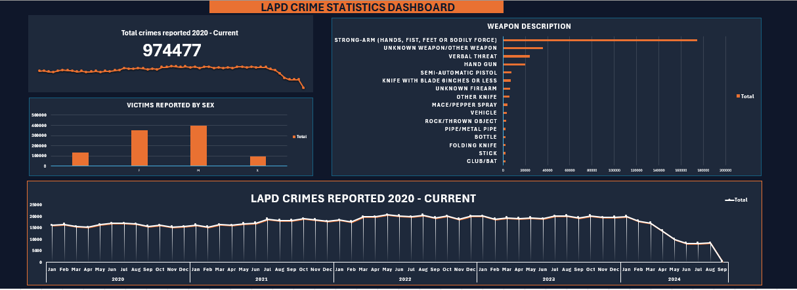

# lapd-crime-dashboard-excel
Automated LAPD crime analysis dashboard built using Excel Power Pivot and Pivot Tables
# 📊 LAPD Crime Statistics Dashboard | Excel + Power Pivot

## 📌 Overview
This project is an automated Excel dashboard built using Power Pivot and Pivot Tables to analyze LAPD crime data from 2020 to 2024.

The dashboard combines multiple yearly CSV datasets into a centralized data model and dynamically updates visualizations when new data files are added and refreshed.

---

## 🎯 Project Objectives
- Analyze crime trends across multiple years
- Identify the most common weapon descriptions
- Explore victim demographics
- Build an automated reporting workflow in Excel
- Create a scalable Power Pivot data model

---

## 🛠 Tools & Technologies
- Microsoft Excel
- Power Pivot
- Pivot Tables
- Pivot Charts
- CSV Data Integration

---

## ⚙️ Features
- Automated multi-year data integration
- Dynamic Pivot Table & Chart updates
- Interactive dashboard reporting
- Crime trend analysis by year
- Victim demographic breakdown
- Weapon description analysis
- Centralized Power Pivot data model

---

## 🔄 Automation Workflow
1. Add new yearly LAPD CSV file
2. Refresh the Power Pivot data model
3. Pivot Tables update automatically
4. Dashboard charts refresh dynamically

---

## 📊 Dashboard Preview



---

## 📈 Key Insights
- Crime levels increased steadily through 2023 before declining in the latest available data
- Strong-arm incidents were among the most frequently reported weapon categories
- Male victims represented the majority of reported cases
- Certain crime categories showed noticeable year-over-year growth patterns

---

## 📥 Full Workbook Access

Due to GitHub file size limitations, the complete Power Pivot workbook is hosted externally.

👉 [Download the Full Excel Dashboard]
https://docs.google.com/spreadsheets/d/1ZPhlpUkeee54TAcMoZjKMu19U2-aDm_q/edit?usp=sharing&ouid=113168160160357991465&rtpof=true&sd=true

---

## 📂 Repository Structure

```bash
lapd-crime-dashboard-excel/
│
├── data/
│   └── sample-lapd-data.csv
│
├── dashboard/
│   └── LAPD_Dashboard_Portfolio.xlsx
│
├── images/
│   └── dashboard-preview.png
│
└── README.md
```

---

## 🚀 Future Improvements
- Build a Power BI version of the dashboard
- Add geospatial crime mapping
- Include forecasting and trend analysis
- Add interactive slicers and filters
- Improve dashboard UI/UX design

---

